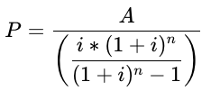

# Loan Calculator

This Python Application helps calculate loan re-payment scheduling for two different types of loans, annuity and differentiated

## Annuity
Annuity type of payment consists in paying a fixed sum of money at specified intervals, for example, each month or each year. The annuity payment amount is precisely this fixed sum of money that you need to pay at regular intervals.

There are four parameters that are considered when calculating annuity payments

 **A** = Annuity payment

**P** = Loan principal

**i** = Nominal (monthly) interest rate. Usually 1/12 on annual interest rate. For example, if your annual interest rate = 12% then i = 0.01

**n** = Number of periods, usually the number of months which repayments will be made

This application allows you to calculate the above parameters through applying the following formulae:

| Type              | Formula                                 |
|-------------------|-----------------------------------------|
| Annuity           |      |
| Principal         |  |
| Number of Periods |      |

*NOTE: This application always require the annual interest to be included as one of the parameters*

## Differentiated

Differentiated payment consists of paying varying amounts every month where the loan principal is reduced by a constant amount each month.

This type of payment takes similar parameters as annuity payments. P (principal), i (nominal interest rate), and n (number of periods) are the same as denoted above.

In addition to those 3, it also considers the following parameters

**D** = *m*'th differentiated payment

**m** = current repayment month

The differentiated payment can be calculated by applying the following formula:


## How to run

Code for the application can be found under [../task/creditcalc/creditcalc.py](task/creditcalc/creditcalc.py)

The application uses the `argparse` module to handle parameters.

* `--type` argument indicates the type of payment: `"annuity"` or `"diff"` must always be provided
* `--payment` is the payment amount. It can be calculated using the provided principal, interest, and number of months
* `--principal` can be calculate if you know the interest, annuity payment, and number of months.
* `--periods` denotes the number of months needed to repay the loan. It's calculated based on the interest, annuity payment, and principal.
* `--interest` is specified as the annual rate without a percent sign. Note that it can accept a floating-point value. The calculator can't calculate the interest, so it must always be provided. 

> Consider the following when executing the program
> - A minimum of 4 parameters are required to successfully run the program.
> - `--type` are always required as one of the parameters
> - 3/4 of parameters from payment, principal, periods and interest must also always be included with one them has to be ``--interest``
> - `--interest` must be provided as an annual rate. The program automatically converts it into nominal.

## Examples

Here are a few examples of how to run the program and its output. The Overpayment represents the total interest that has been paid over the course of the loan.

**Example 1:** *Calculate the annuity (monthly) payment amount*
```commandline
> python creditcalc.py --type=annuity --principal=1000000 --periods=60 --interest=10
Your annuity payment = 21248!
Overpayment = 274880
```

**Example 2:** *Calculate the loan principal*
```commandline
> python creditcalc.py --type=annuity --payment=8722 --periods=120 --interest=5.6
Your loan principal = 800018!
Overpayment = 246622
```

**Example 3:** *Calculate the annuity (monthly) payment amount*
```commandline
> python creditcalc.py --type=annuity --principal=500000 --payment=23000 --interest=7.8
It will take 2 years to repay this loan!
Overpayment = 52000
```

**Example 4:** *Calculate the differentiated payment*
```commandline
> python creditcalc.py --type=diff --principal=500000 --periods=8 --interest=7.8
Month 1: payment is 65750
Month 2: payment is 65344
Month 3: payment is 64938
Month 4: payment is 64532
Month 5: payment is 64125
Month 6: payment is 63719
Month 7: payment is 63313
Month 8: payment is 62907

Overpayment = 14628
```

**Example 5:** *Incorrect paramters*
```commandline
> python creditcalc.py --type=diff --principal=1000000 --payment=104000
Incorrect parameters.
```
